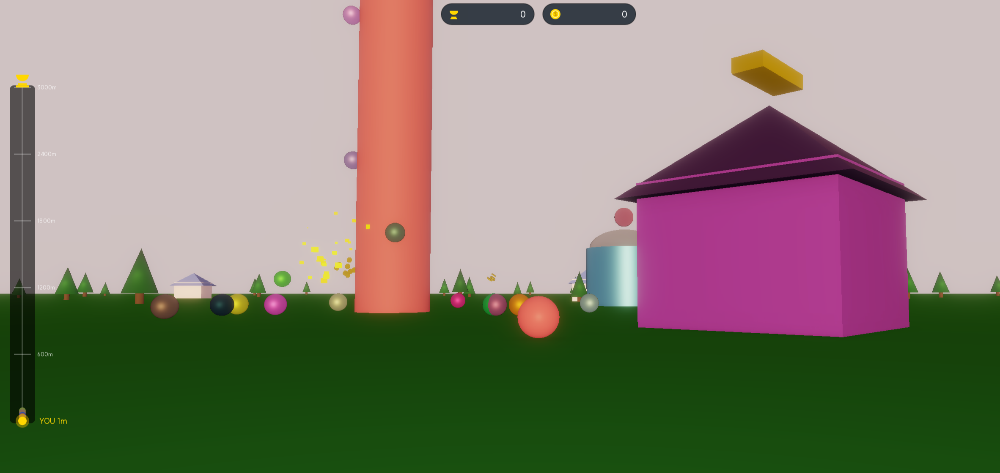

# 🎮 游戏名称

## 📖 简介

攀爬地图中央的高塔，根据攀爬高度将累积金币，跳下落地时获得金币；
使用金币在翅膀商店增加自身攀爬速度，可以爬的更高；
使用金币在宠物商店抽奖增加金币获取，宠物可以合成升星；
攀爬时小心被其他玩家击落！当然你也可以去尝试击落其他玩家…
攀爬到塔顶可获得奖杯，奖杯可用于解锁饰品栏

## 🎮 操作方式

- **上下左右**：移动/攀爬
- **空格**：跳跃/从塔上跳下
- **F交互**：靠近商店后点击F交互
- **调试指令**：F3打开面板后点击对应数字

## 📦 依赖

- UrhoX 引擎 v1.0.0+

## 🚀 运行

从 Start() 启动

## 📄 开源协议

MIT License